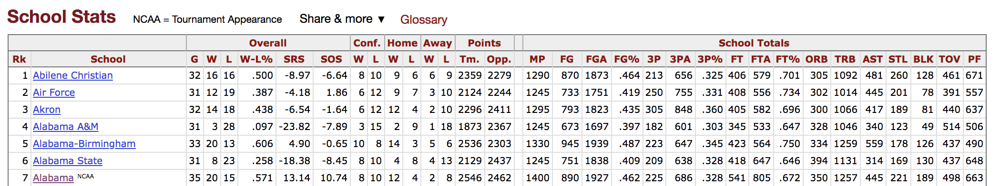

# Can we predict performance in the NCAA men's basketball tournament based on team statistics?

It's March! and college basketball fans across the USA are filling in their brackets. The NCAA Men's Basketball Tournament, also know as March Madness is an annual 64 team single-elimination tournament held to determine a national champion. Can a linear model help fans predict the winners?

## Table of Contents
1. [Dataset](#dataset)
2. [Tournament Background](#tournament-background)
    *
    *
    *
3. [Model Exploration](#model-exploration)
4. [Conclusions](#conclusions)
    *
    *
    * [Results](#results)
5. [Going Forward](#goint-forward)

## Dataset

All data was collected from the Sport Reference College Basketball Website.(https://www.sports-reference.com/cbb/).  The  CSV files contained the data I needed, except for number of NCAA Tournament Wins, which I pulled from a different location on the same website.

  
<b>Figure 1: </b> Data collected from www.sports-reference.com/cbb/    

## Tournament Background

Magnetic Resonance Imaging (MRI) is the most common diagnostic tool brain tumors due primarily to it's noninvasive nature and ability to image diverse tissue types and physiological processes. MRI uses a magnetic gradient and radio frequency pulses to take repetitive axial slices of the brain and construct a 3-dimensional representation(Figure 2). Each brain scan 155 slices, with each pixel representing a 1mm3 voxel.  

  
 <b> Figure 2: </b> (Left) Basic MRI workflow. Slices are taken axially at 1mm increments, creating the 3-dimensional rendering (right). Note that this is only one of four commonly-used pulse sequences used for tumor segmentation. 

### Model Exploration ([code](https://github.com/naldeborgh7575/brain_segmentation/blob/master/code/brain_pipeline.py))

One of the challenges in working with MRI data is dealing with the artifacts produced either by inhomogeneity in the magnetic field or small movements made by the patient during scan time. Oftentimes a bias will be present across the resulting scans (Figure 3), which can effect the segmentation results particularly in the setting of computer-based models.

  
<b>Figure 3:</b> Brain scans before and after n4ITK bias correction. Notice the higher intensity at the bottom of the image on the right. This can be a source of false positives in a computer segmentation.   

I employed an [n4ITK bias correction](http://www.ncbi.nlm.nih.gov/pubmed/20378467) on all T1 and T1C images in the dataset ([code](https://github.com/naldeborgh7575/brain_segmentation/blob/master/code/n4_bias_correction.py)), which removed the intensity gradient on each scan. Additional image pre-processing requires standardizing the pixel intensities, since MRI intensities are expressed in arbitrary units and may differ significantly between machines used and scan times.

### Conclusions
There are multiple radio frequency pulse sequences that can be used to illuminate different types of tissue. For adequate segmentation there are often four different unique sequences acquired: Fluid Attenuated Inversion Recovery (FLAIR), T1, T1-contrasted, and T2 (Figure 4). Each of these pulse sequences exploits the distinct chemical and physiological characteristics of various tissue types, resulting in contrast between the individual classes. Notice the variability in intensities among the four images in Figure 4, all of which are images of the same brain taken with different pulse sequences.

  
<b> Figure 4: </b> Flair (top left), T1, T1C and T2 (bottom right) pulse sequences. 

### Going Forward
Notice now that a single patient will produce upwards of 600 images from a single MRI, given that all four sequences produce 155 slices each (Figure 5). To get a satisfactory manual segmentation a radiologist must spend several hours tediously determining which voxels belong to which class. In the setting of malignant brain tumors, an algorithmic alternative would give clinicians more time focusing on the wellbeing of the patient, allowing for more immediate patient care and higher throughput treatment times.

  

  
 <b>Figure 5:</b> (Top) Representative scans from each tumor imaging sequence. Approximately 600 images need to be analyzed per brain for a segmentation. (Bottom) The results of a complete tumor segmentation.

Automatic tumor segmentation has the potential to decrease lag time between diagnostic tests and treatment by providing an efficient and standardized report of tumor location in a fraction of the time it would take a radiologist to do so.

## References

    1. Havaei, M. et. al, Brain Tumor Segmentation with Deep Neural Networks. arXiv preprint arXiv:1505.03540, 2015.
    2. Hubel, D. and Wiesel, T. Receptive fields and functional architecture of monkey striate cortex. Journal of Physiology 1968.
    3. Kistler et. al, The virtual skeleton database: an open access repository for biomedical research and collaboration. JMIR, 2013.
    4. Menze et al., The Multimodal Brain Tumor Image Segmentation Benchmark (BRATS), IEEE Trans. Med. Imaging, 2015.
    5. Stupp et al., Effects of radiotherapy with concomitant and adjuvant temozolomide versus radiotherapy alone on survival in glioblastoma in a randomised phase III study: 5-year analysis of the EORTC-NCIC trial. The Lancet Onc., 2009.
    6. Tustison, NJ. et. al, N4ITK: improved N3 bias correction. IEEE Trans Med Imaging, 2010.
